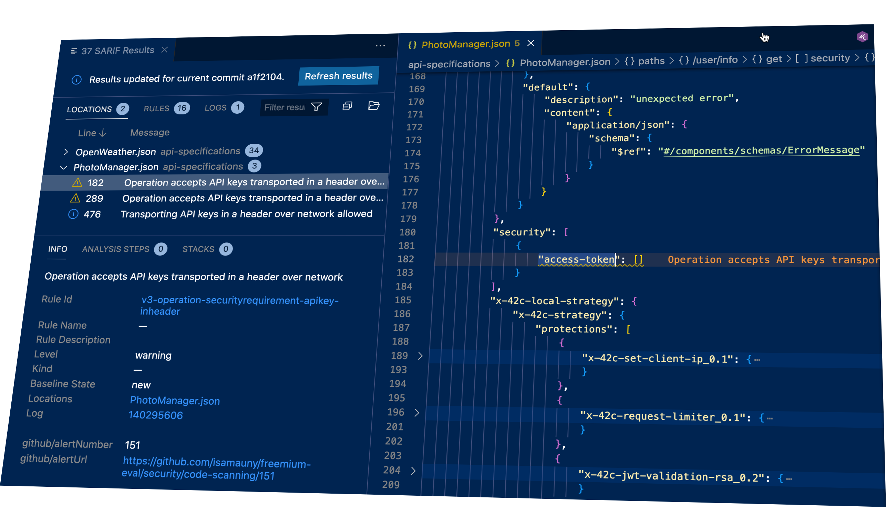

# GitHub Action: 42Crunch REST API Static Security Testing (Freemium version)

The REST API Static Security Testing action locates REST API contracts that follow the OpenAPI Specification (OAS, formerly known as Swagger) and runs thorough security checks on them. Both OAS v2 and v3.0.x are supported, in both JSON and YAML format.

This Github action is working in a freemium mode: organizations can run 25 audits per month per repository, with a maximum of three repositories per organization.

You can use this action in the following scenarios:
- Add an automatic static API security testing (SAST) task to your CI/CD workflows.
- Perform these checks on pull request reviews and/or code merges.
- Flag the located issues in GitHub's Security / Code Scanning Alerts.

## Discover APIs in your repositories

By default, this action will:

1. Look for any `.json` and `.yaml` or `.yml` files in the repository.
2. Pick the files that use OpenAPI (a.k.a Swagger ) 2.0 or 3.0x schemas.
3. Perform security audit on each OpenAPI definition.

## Action inputs

### `upload-to-code-scanning`

Upload the audit results in SARIF format to [Github Code Scanning](https://docs.github.com/en/github/finding-security-vulnerabilities-and-errors-in-your-code/about-code-scanning).  Note that the workflow must have specific permissions for this step to be successful. This assumes you have Github Advanced security enabled.
Default is `false`.

```YAML
...
jobs:
  run_42c_audit:
    permissions:
      contents: read # for actions/checkout to fetch code
      security-events: write # for results upload to Github Code Scanning
...
```

### `enforce-sqg`

If set to `true`, the task returns a failure when security quality gates (SQG) criteria have failed. Security quality gates are a set of rules that define the minimum security requirements for an API. This freemium action has [default gate values]() which cannot be changed.
If set to `false`, the action reports SQG failures scenarios without enforcing them, giving a grace period to development teams before breaking builds.

Default is `false`.  

### `log-level`

Sets the level of details in the action logs, one of: `FATAL`, `ERROR`, `WARN`, `INFO`, `DEBUG`. 
Default is `INFO`.

### `data-enrich`

Enrichs the OpenAPI file leveraging 42Crunch default [data dictionary](https://docs.42crunch.com/latest/content/concepts/data_dictionaries.htm). For each property with a standard format (such as uuid or date-time), patterns and constraints are added to the OpenAPI file before it is audited.

Default is `false`.

### `sarif-report`

Converts the audit raw JSON format to SARIF and saves the results into a specified file.
If not present, the SARIF report is not generated.

### `audit-reports-dir`

If set, this action saves the audit reports in the specified directory, as well as metatada information relative to the audit. Reports are exported in JSON format. 
If not present, the audit reports are not saved.

### `export-as-pdf`

If set, this action exports a summary of all the audit reports as a PDF file. If not present, the PDF report is not generated.

## Examples

### Single step example

A typical new step in an existing workflow would look like this:

```yaml
- name: 42crunch-static-api-testing
        uses: 42Crunch/api-security-audit-action-freemium@v1
        with:
        	upload-to-code-scanning: true
        	enforce-sqg: false
          sarif-report: 42Crunch_AuditReport_${{ github.run_id }}.SARIF
          export-as-pdf: 42Crunch_AuditReport_${{ github.run_id }}.pdf
          audit-reports-dir: ${{ github.workspace }}/reports
          log-level: info
```

### Full workflow example

A typical workflow which checks out the contents of the repository, runs Security Audit on each of the OpenAPI files found in the workspace and saves the resulting SARIF file as an artifact would look like this:

```yaml
name: "42Crunch API Security Audit"

on:
  workflow_dispatch:
  push:
    branches: [ "main" ]
  pull_request:
    # The branches below must be a subset of the branches above
    branches: [ "main" ]  

jobs:
  run_42c_audit:
    permissions:
      contents: read # for actions/checkout to fetch code
      security-events: write # for results upload to Github Code Scanning
    runs-on: ubuntu-latest
    steps:
      - name: Checkout repo
        uses: actions/checkout@v4
      - name: Audit API definition for security issues
        uses: 42Crunch/api-security-audit-action-freemium@v1
        with:
          # Upload results to Github Code Scanning
          # Set to false if you don't have Github Advanced Security enabled.
          upload-to-code-scanning: true
          log-level: info
          sarif-report: 42Crunch_AuditReport_${{ github.run_id }}.SARIF
      - name: save-audit-report
        if: always()        
        uses: actions/upload-artifact@v3
        with:
          name: 42Crunch_AuditReport_${{ github.run_id }}
          path: 42Crunch_AuditReport_${{ github.run_id }}.SARIF
          if-no-files-found: error
```
## Viewing SARIF Files in VisualStudio Code

Microsoft provides a [SARIF viewer extension](https://marketplace.visualstudio.com/items?itemName=MS-SarifVSCode.sarif-viewer) you can install into VisualStudio code. Used in conjunction with [42Crunch extension](https://marketplace.visualstudio.com/items?itemName=42Crunch.vscode-openapi), it helps you view issues found by 42Crunch Audit within the OpenAPI file.

The SARIF extension, once connected to GitHub can directly display the issues from GitHub Code Scanning.



## Limitations

The freemium version lets you fully test 42Crunch audit features. It does have usage limitations:

- Organizations on freemium service are limited to 25 audits per repository, with a maximum of three repositories per GitHub organization. The limit is reset every calendar month.
- Only the default security quality gates (SQGs) are included.
- Only the standard data dictionary is included.

## Testing this action 

If you want to easily test this action, you can fork [this project](https://github.com/42Crunch/apisecurity-tutorial). It contains several sample OpenAPI files with security issues.

## Support

The action is maintained by the 42Crunch ecosystems team. If you run into an issue, or have a question not answered here, you can create a support ticket at [support.42crunch.com](https://support.42crunch.com/) and we will be happy to help.

When reporting an issue, do include:
- The version of the GitHub action
- Relevant logs and error messages
- Steps to reproduce the issue
